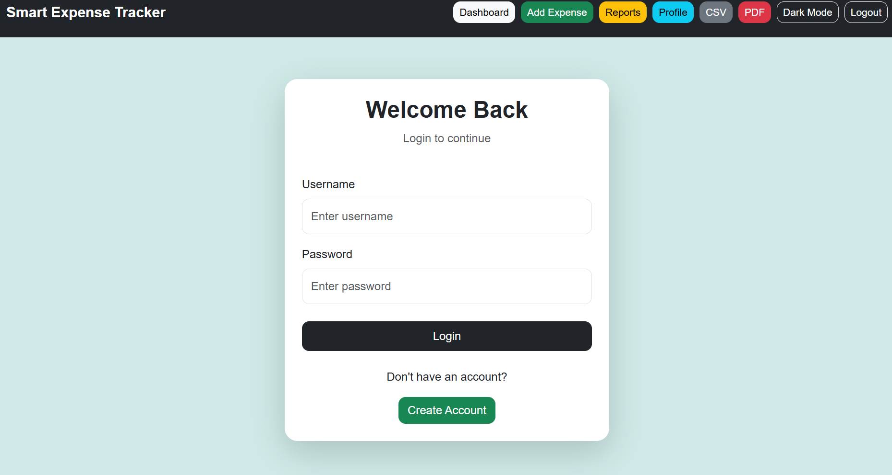
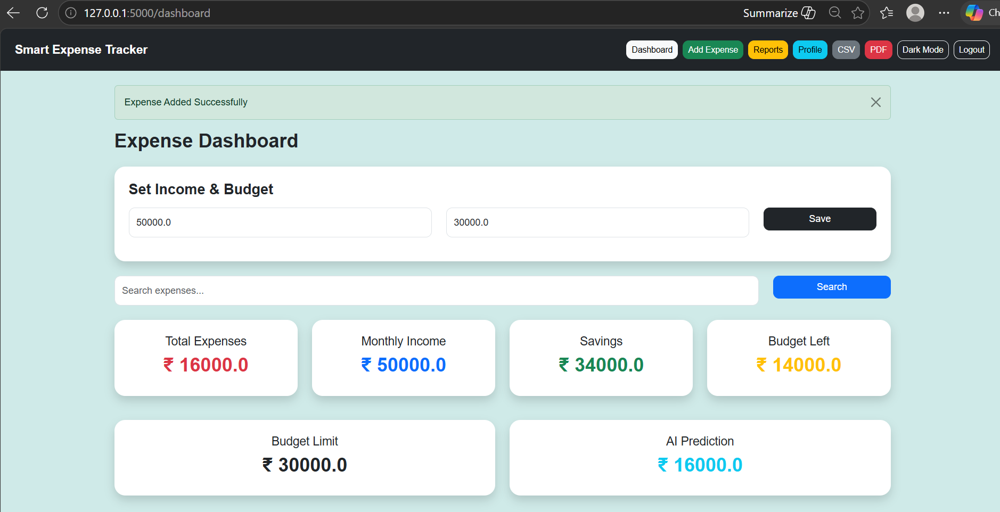
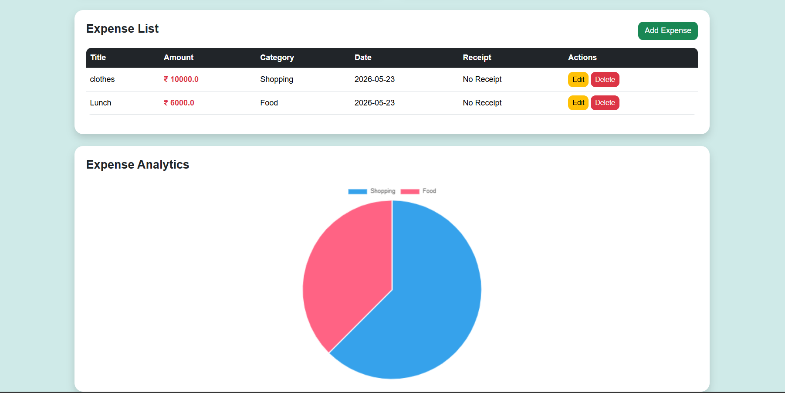
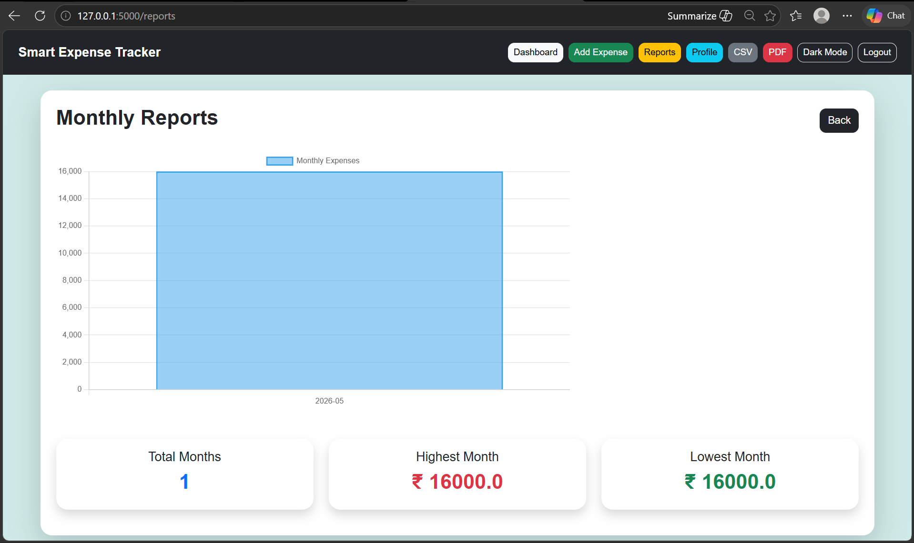

## Smart AI Expense Tracker 🚀

An AI-powered Expense Tracker web application built using Python Flask that helps users manage daily expenses, monitor budgets, analyze spending patterns, and generate financial reports efficiently.

The application provides a clean dashboard with expense analytics, budget alerts, authentication, admin controls, and AI-based expense prediction for smarter financial management.

## 📌 Features
```
✅ User Authentication System
✅ Expense Management (Add / Edit / Delete Expenses)
✅ Income Tracking System
✅ Budget Management & Alerts
✅ AI Expense Prediction using Machine Learning
✅ Interactive Expense Analytics Dashboard
✅ Admin Panel for User Management
✅ CSV & PDF Report Export
✅ Search & Filter Expenses
✅ Responsive UI Design
✅ Secure Password Hashing
✅ Receipt Upload Support
```
## 🧠 AI Module

The application uses Linear Regression from scikit-learn to predict future expenses based on historical spending data.
```
AI Features
Expense trend prediction
Future monthly expense forecasting
Financial planning assistance
🛠️ Technologies Used
Backend
Python
Flask
Flask-Login
SQLite
SQLAlchemy
Frontend
HTML5
CSS3
Bootstrap 5
JavaScript
Chart.js
Machine Learning
scikit-learn
NumPy
Pandas
Report Generation
ReportLab
CSV Module
```
```
## 📂 Project Structure
smart-ai-expense-tracker/
│
├── app.py
├── requirements.txt
├── README.md
├── .gitignore
│
├── static/
│   ├── style.css
│   ├── script.js
│   └── uploads/
│
├── templates/
│   ├── base.html
│   ├── login.html
│   ├── register.html
│   ├── dashboard.html
│   ├── add_expense.html
│   ├── edit_expense.html
│   ├── reports.html
│   ├── profile.html
│   └── admin.html
│
├── exports/
├── screenshots/
└── instance/
```
## ⚙️ Installation & Setup
1️⃣ Clone the Repository
    git clone https://github.com/rayees051/smart-AI-expense-tracker.git

2️⃣ Move into the Project Directory
    cd expense-tracker

3️⃣ Create Virtual Environment (Recommended)
Windows

python -m venv venv

venv\Scripts\activate
Linux / macOS
python3 -m venv venv
source venv/bin/activate

4️⃣ Install Required Packages
pip install -r requirements.txt

5️⃣ Run the Flask Application
python app.py

🌐 Application URL

After running the server, open:

http://127.0.0.1:5000


##  📊 Dashboard Functionalities

The dashboard provides:
```
Total Income
Total Expenses
Savings Calculation
Budget Remaining
AI Prediction Results
Expense Analytics Charts
Recent Transactions
```

## 📈 Analytics & Reports

The system provides interactive visual analytics using Chart.js:
```
Expense Trend Charts
Category-wise Spending Analysis
Income vs Expense Comparison
Budget Utilization Charts
Export Options
CSV Export
PDF Report Generation
```

## 🔐 Security Features
```
Secure User Authentication
Password Hashing using Werkzeug/Bcrypt
Session Management
Admin Access Control
Protected Routes
```


## 👨‍💼 Admin Panel

Admin users can:
```
View Registered Users
Monitor Expenses
Activate/Deactivate Accounts
Manage User Data
```

## 📷 Screenshots
Login Page



##  Dashboard




## Expense Analytics



##  Reports Page



## 🚀 Future Improvements
```
Banking API Integration
Email & SMS Notifications
Advanced AI Prediction Models
Mobile Application
Multi-Currency Support
Dark Mode UI
Cloud Database Integration
```

## 📦 Requirements

Example packages used:
```
Flask
Flask-Login
Flask-SQLAlchemy
scikit-learn
numpy
pandas
reportlab
matplotlib
```
## 🧪 Algorithms Used
```
Algorithm	            Purpose
Linear Regression	    Expense Prediction
Bcrypt Hashing	        Password Security
Moving Average	        Trend Analysis
Binary Search	        Record Retrieval
```

## 🎯 Project Objectives
```
Simplify personal finance management
Provide intelligent expense prediction
Help users avoid overspending
Improve financial awareness using analytics
```

## 💡 Learning Outcomes

This project demonstrates:
````
Full Stack Web Development
Database Management
Machine Learning Integration
Data Visualization
Authentication & Security
Report Generation
````
## 👨‍💻 Author
RAYEES AKBAR


📄 License

This project is licensed under the MIT License.
